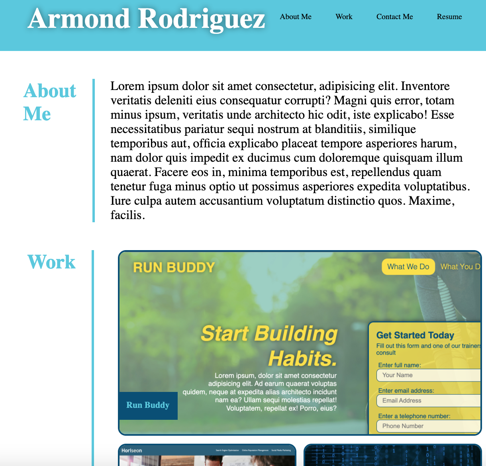
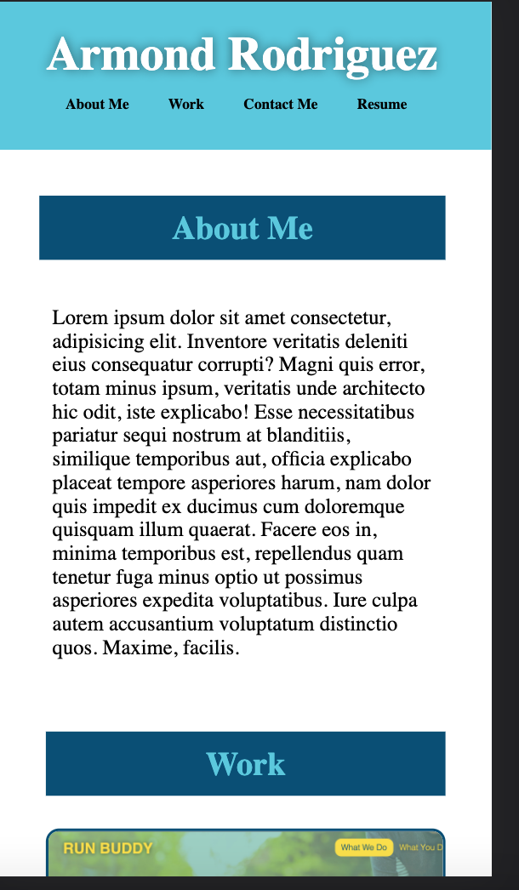

# Portfolio

## Description

This project is a presentation of my work. The objective of this project is to showcase the work I've done and demonstrate my understanding of HTML and CSS. In the building of this projects I made sure that the page meets accessibility standards as well as added properties to ensure that the page would be responsive to the users screensize. I intend to add more features as my knowledge grows to better display my skills to potential clients/employers.

## Features

- Webpage responsiveness using media query.
- Interactivity using pseudo elements.
- Clean/ minimalistic design using flexbox.
- Added links that redirect based on their design function.

## Usage

The website was deployed through github and can be accessed via the provided link below. The media is scalable for smaller screens. There is a media query set specically for media width of 375px and will be updated for more queries in the future.

## Links

[Link to Deplyed Website](https://armondr.github.io/portfolio/)

## Screenshots

## Credits 

contributions to the constuction of this portfolio page goes to the program TA: John Titus for assistance in troubleshooting page layout bugs concerning flexbox properties.

## Licence

MIT License

Copyright (c) [2021] [Armond Rodriguez]

Permission is hereby granted, free of charge, to any person obtaining a copy
of this software and associated documentation files (the "Software"), to deal
in the Software without restriction, including without limitation the rights
to use, copy, modify, merge, publish, distribute, sublicense, and/or sell
copies of the Software, and to permit persons to whom the Software is
furnished to do so, subject to the following conditions:

The above copyright notice and this permission notice shall be included in all
copies or substantial portions of the Software.

THE SOFTWARE IS PROVIDED "AS IS", WITHOUT WARRANTY OF ANY KIND, EXPRESS OR
IMPLIED, INCLUDING BUT NOT LIMITED TO THE WARRANTIES OF MERCHANTABILITY,
FITNESS FOR A PARTICULAR PURPOSE AND NONINFRINGEMENT. IN NO EVENT SHALL THE
AUTHORS OR COPYRIGHT HOLDERS BE LIABLE FOR ANY CLAIM, DAMAGES OR OTHER
LIABILITY, WHETHER IN AN ACTION OF CONTRACT, TORT OR OTHERWISE, ARISING FROM,
OUT OF OR IN CONNECTION WITH THE SOFTWARE OR THE USE OR OTHER DEALINGS IN THE
SOFTWARE.

### Badges

____

